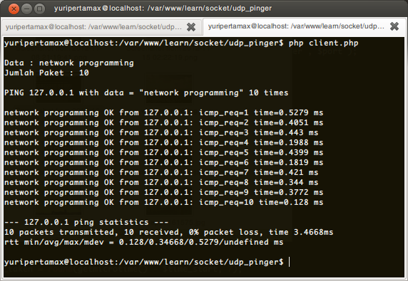

# PHP UDP Pinger

A simple program to simulate how to ping to another host. This program is using [PHP Language](http://php.net).

##Screenshot

## About

### Author

* Yuri Citra Pratama - 0910680068
* Aldim irfani Vikri - 0910683104
* Delis Sukmawati - 0910683030

Network Programming Course

[Information Technology and Computer Science Program](http://ptiik.ub.ac.id) - [Brawijaya University](http://ub.ac.id). 2012